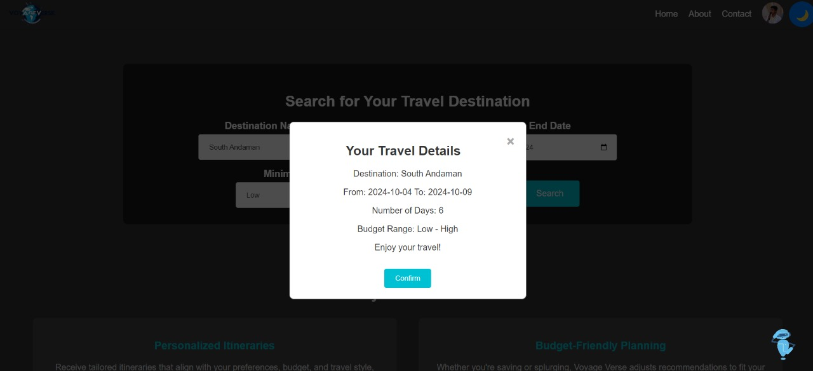
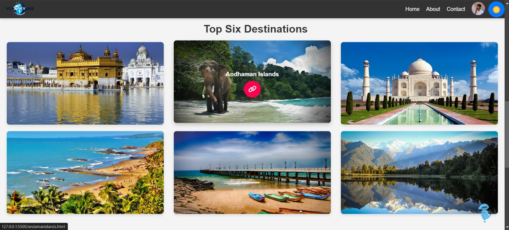
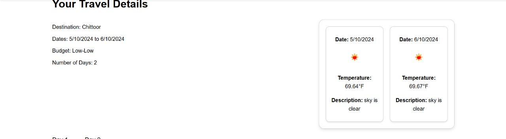
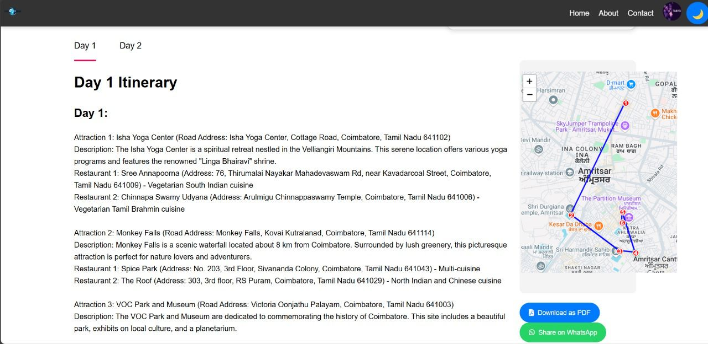

# **Voyage Verse: Crafting Personalized Journeys beyond Imagination**

---

**Voyage Verse** is a cutting-edge web application that leverages Generative AI to design personalized travel itineraries, perfectly suited to your preferences and budget. Traditional travel planning tools often fail to provide the level of customization and real-time insights that modern travelers seek—Voyage Verse fills that gap, creating dynamic, AI-driven travel plans tailored just for you.

---

## **Key Features**

- **Timing Flexibility**:  
  Allow users to adjust or customize the timing of their activities, ensuring plans are adaptable to real-time changes (like traffic or delays).

- **User-Friendly Input Interface**:  
  Make sure the input forms and options for users are simple and clear, enhancing the overall experience.

- **Hotel Recommendations**:  
  Provide suggestions for accommodations, potentially offering options with various price ranges or proximity to planned activities.

- **Activity Suggestions with Delay Considerations**:  
  Offer alternative activity suggestions or adjust timings if a delay is expected, keeping travel smooth even with unforeseen changes.

- **Pricing Range for Activities**:  
  Show pricing ranges for suggested activities, allowing users to select options that fit their budget.

- **Map Integration**:  
  Include dynamic maps that help visualize the planned itinerary, hotels, and activities for easier navigation.

---

## **How It Works**

**Input**:  
Users provide travel details such as destination, budget, and preferences. Voyage Verse uses this information, along with real-time data, to create the perfect travel itinerary.

- **Home Page**:  
  
  
- **Modal for Details Input**:  
  

- **Top Destinations**:  
  

---

## **Usage**

To get started with **Voyage Verse**:

1. Clone the repository:
    ```bash
    git clone https://github.com/yourusername/voyage-verse.git
    ```

2. Navigate to the project directory:
    ```bash
    cd voyage-verse
    ```

3. Install dependencies:
    ```bash
    pip install -r requirements.txt
    ```

4. Run the application (Django):
    ```bash
    python manage.py runserver
    ```

---

## **Technologies Used**

- **Backend**:  
   Django framework powers the backend of the application.

- **Frontend**:  
  - 
  - 
  - 

- **AI & Language Models**:  
  -  Hugging Face Transformers Library for natural language generation.
  
- **Acceleration Library**:  
  -  Intel Acceleration Library with AutoAWQ for efficient model execution.

- **APIs**:  
  - 
  - 
  - OpenWeather API for weather data, Google Maps API for dynamic navigation.

---

## **Output**

The personalized itinerary is provided to users via a beautifully crafted, detailed PDF. Here’s an example of what you can expect:




---

## **Comparison**


